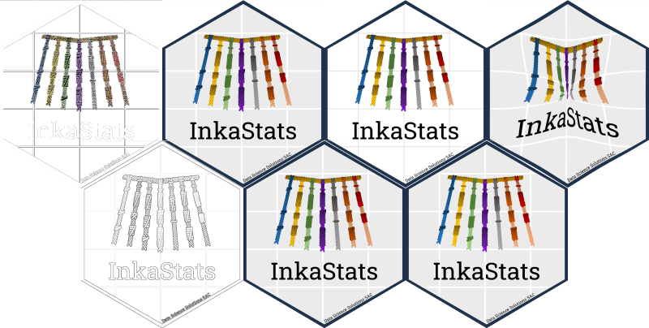
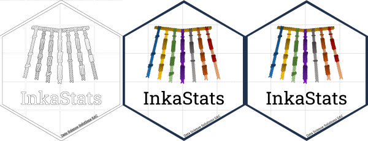

<!-- README.md is generated from README.Rmd. Please edit that file -->

> **Citación**: (Pendiente)

# Hex-Sticker de InkaStats Data Science Solutions

 

En este repositorio encontrarás el código para reproducir la creación
del Hex-Sticker de **InkaStats Data Science Solutions** y la historia
detrás del concepto artístico que inspiró el logo. Además, encontrarás
algunas versiones alternativas de Hex-Stickers así como gif animados.

 

## Arte conceptual

El `quipu` (del quechua `“quipuni”`, nudo en español) fue un sistema
contable elaborado y utilizado por los administradores del imperio Inca,
los quipucamayoc, a principios del siglo XVI. Consiste en un cordón
grueso en la parte superior del que penden numerosos hilos verticales
delgados con nudos de diferentes estilos y colores que representaban
datos relacionados con la contabilidad tributaria incaica, el registro
de los censos, posesión de tierras, el trabajo, la producción, entre
diversos tipos de datos numéricos. Así, el `quipu` no solo funcionaba
como una `base de datos`, también puede considerarsele como la
representación más antigua de la `Estadística`y `Ciencia de Datos` que
tenemos en América Latina.

En **InkaStat** quisimos rendirle tributo a esta milenaria herramienta
de manejo y análisis de datos diseñada por los Incas, por lo que hicimos
un boceto a mano de este, mediante el programa
[`Canva`](https://www.canva.com/es_419/), y lo antepusimos ante un fondo
generado con el paquet [ggplot2](https://ggplot2.tidyverse.org/) de R
usando el tema predefinido `theme_gray()`, lo que generó un plano
cartesiano con aspecto de piedras de construcción incaica.

Asimismo, no perdimos la oportunidad de utilizar al quipu como una base
de datos y almacenar información relevante. Así, cada hilo de nuestro
logo representa un año que consideramos emblemático para la Estadística
y la Ciencia de Datos. Siete fechas clave han sido registradas cuyo
significado se describen a continuación:

## Hex-Wall de Hex-Stickers alternativos

Se puestra una pared de stickers alternativos generados con el paquete
Hex-Wall.

<!-- -->

## Gifs animados de Hex-Stickers

Por último, un par de gifs animados:

<!-- -->

## Autores

-   [Anthony Romero](https://github.com/AnthonyRomeroC)
    (<anthony.romeromh@gmail.com>)

    -   Boceto y diseño gráfico del Quipu.

    -   Co-Codeo de Hex-Sticker.

    -   Redacción de arte conceptual.

-   [Christian Vasquez](https://github.com/cvasquezvel)
    (<cvasquezvel@gmail.com>)

    -   Co-creación de nombre InkaStats.

    -   Revisión y aporte con ideas al Hex-Sticker.

    -   Co-ideación de arte conceptual

-   [Percy Soto-Becerra](https://github.com/psotob)
    (<percys1991@gmail.com>)

    -   Co-creación de nombre InkaStats.

    -   Codeo de Hex-Sticker.

    -   Ideación de arte conceptual.

    -   Creación del repositorio GitHub.

## Referencias Bibliográficas

-   Wong Torres Z., Salcedo Guzmán L. Quipus: nudos numéricos y
    parlantes. Quipucamayoc, 2005; 12(24). Disponible en:
    <https://doi.org/10.15381/quipu.v12i24.5435>

-   Macho Stadler M. El quipu: ¿algo más que un registro numérico?
    \[Internet\]. Cuaderno de cultura científica. 2015. Disponible en:
    <https://culturacientifica.com/2015/09/16/el-quipu-algo-mas-que-un-registro-numerico/>

-   Ronald Fisher. Wikipedia, La enciclopedia libre. 2022. Disponible
    en: <https://es.wikipedia.org/wiki/Ronald_Fisher>

-   Tukey J. The Future of Data Analysis. The Annals of Mathematical
    Statistics. 1962; 33(1):1–67. <doi:10.1214/aoms/1177704711>

-   Bradley E. Bootstrap Methods: Another Look at the Jackknife. The
    Annals of Statistics. 1979; 7(1):1-26. Disponible en:
    <https://www.jstor.org/stable/2958830>

-   Young P, Hortis De Smith V, Chambi M, Finn B. Florence Nightingale
    (1820-1910), a 101 años de su fallecimiento. Rev. méd. Chile. 2011;
    139(6):807-813. Disponible en:
    <http://dx.doi.org/10.4067/S0034-98872011000600017>

-   Ballesteros D., Blanco F. Mujeres que aplicaron la estadística para
    transformar el mundo: Florence Nightingale y Madelein Guilbert. VI
    Congreso internacional de Historia de la Estadística y de la
    Probabilidad. 2011. Disponible en: <https://eprints.ucm.es/16911/>

-   Gonzales R. El test de Turing: dos mitos, un dogma. Revista de
    filosofía. 2007; 63:37-53. Disponible en:
    <http://dx.doi.org/10.4067/S0718-43602007000100003>
